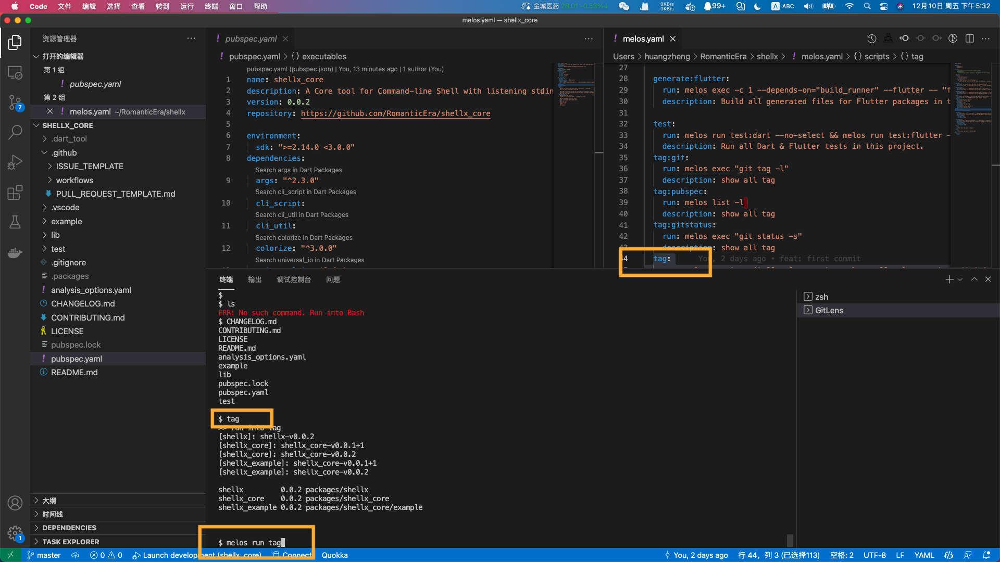

<!-- This file uses generated code. Visit https://pub.dev/packages/readme_helper for usage information. -->
<!-- #code shellx.dart -->
```dart
import 'dart:async';

import 'package:melos/melos.dart';
import 'package:shellx_core/shellx_core.dart';
import 'package:universal_io/io.dart';

Future<void> main(List<String> args) async {
  final config = await MelosWorkspaceConfig.fromDirectory(Directory.current);
  Shell()
    ..fromMelos(config.scripts.keys)
    ..run();
}

// Map.fromIterables(scripts, scripts.map((e) => MelosCommand(e)));

extension MeolsShell on Shell {
  void fromMelos(Iterable<String> scripts) => scripts.forEach(addMelos);
  void addMelos(String element) => addCommand(element, MelosCommand(element));
}

```
<!-- // end of #code -->


it would listen you input. So you can think it is a simple-shell like bash.